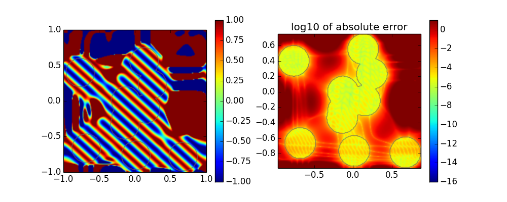
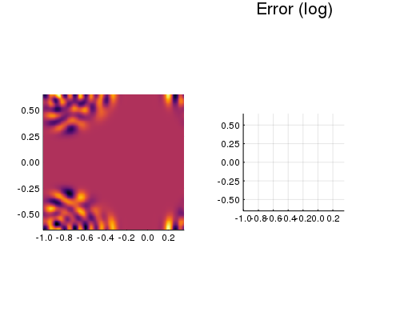

[](https://travis-ci.org/daanhb/FrameFun.jl)
[](https://coveralls.io/github/daanhb/FrameFun.jl)

FrameFun
========

Exploring practical possibilities of approximating functions with frames rather than with a basis. The package is heavily inspired by the Chebfun project and the Julia package ApproxFun.

# Frame Approximations in 1D

After choosing a suitable Basis and Domain, any function can be approximated in the resulting frame:
```julia
using BasisFunctions
using Plots
using FrameFun
B = FourierBasis(61)
D = Interval(-0.5,0.5)
f(x) = x
F = Fun(f,B,D)

plot(F,plot_ext=true); plot(F,f,plot_ext=true)
```


The bases support any AbstractFloat subtype, so high precision approximations are straightforward:

```julia
B = FourierBasis(61,BigFloat)
F = Fun(f,B,D)

plot(F,plot_ext=true); plot(F,f,plot_ext=true)
```


# Frame Approximations in 2D

In higher dimensions, a basis can be any tensorproduct of (scaled) lower dimensional bases:
```julia
C = Disk(1.0)- Disk(0.3,[0.2; 0.5])
B = FourierBasis(31,-1.3,1.3) ⊗ FourierBasis(31,-1.3,1.3)
f(x,y) = exp(x+y)
F = Fun(f,B,C)

heatmap(F,plot_ext=true); plot(F,f,plot_ext=true)
```


Basis types can easily be mixed and matched, and domains can be arbitrarily complex:

```julia
dom = randomcircles(10)
B = FourierBasis(31) ⊗ ChebyshevBasis(31)
f(x,y) = cos(20*x+22*y)
F = Fun(f,B,dom)

heatmap(F,plot_ext=true), plot(F,f,plot_ext=true)
```



Even fractal domains are not a problem:

```julia
B = FourierBasis(31,-1.0,0.35) ⊗ FourierBasis(31,-0.65,0.65)
f(x,y) = cos(10*x*y)
F = Fun(f, B, Mandelbrot())

heatmap(F,plot_ext=true), plot(F,f,ext=true)
```


